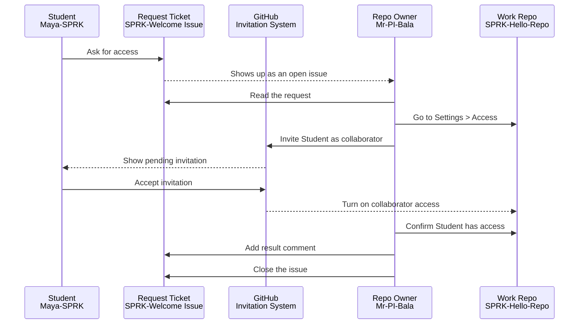
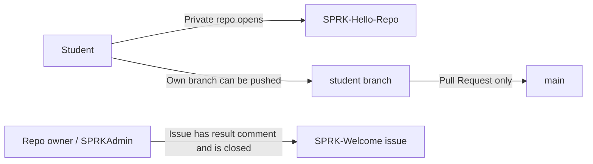
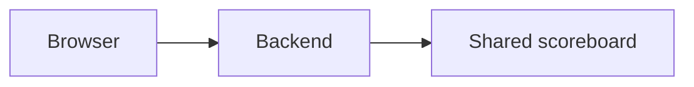

# SPRK Welcome Project Guide
This guide is for SPRK maintainers, SPRKAdmin, SPRKTeacher, AgentDraven, and Codex.

## Master Table Of Contents
- [Document Roles](#document-roles)
- [Governance](#governance)
- [Repository Purpose](#repository-purpose)
- [Baseline Structure](#baseline-structure)
- [AURAVYBE Organization Links](#auravybe-organization-links)
- [Access And Approval Flow](#access-and-approval-flow)
- [Documentation Principles](#documentation-principles)
- [Formative Insights](#formative-insights)
- [Diagram Standard](#diagram-standard)
- [Mission Guide Standard](#mission-guide-standard)
- [Classroom Network Strategy](#classroom-network-strategy)
- [Release Flow](#release-flow)

## Document Roles
- `README.md`: public front door.
- `docs/USER_GUIDE.md`: public doorway guide for starting from SPRK-Welcome.
- `docs/SPRK_Git_Repository_UserGuide.md`: master GitHub accounts, access requests, branches, commits, pushes, and Pull Requests guide.
- `docs/SPRK_CodeSpaces_UserGuide.md`: master Codespaces runtime levels, safe checks, and graphics limits guide.
- `docs/SPRK_Classroom_Network_Test_Guide.md`: classroom backend-host, device, and network validation guide.
- `docs/SPRK_VSCode_UserGuide.md`: master VS Code Markdown preview/editing, Mermaid, and extension guide.
- `docs/PROJECT_GUIDE.md`: maintainer path for governance and repository operations.
- `docs/CHANGELOG.md`: version history.
- `LICENSE`: MERIT/AURAVYBE license terms.
- `VERSION`: current version.

## Governance
This repository is owned by `Mr-PI-Bala`.

Inside this repository, governance stops at `Mr-PI-Bala`. AgentDraven acts as `SPRKAdmin` when performing operational work for this repository.

Role categories:

- `SPRKAdmin`: administrative and repository-governance execution.
- `SPRKTeacher`: classroom/staff review, feedback, and student support.
- `SPRKStudent`: student learner, tester, contributor, and critique voice.

## Repository Purpose
`SPRK-Welcome` is the public doorway for SPRK. It should stay public, simple, and student-facing.

It advertises the primary SPRK path and explains how students request access to working repositories.

Public-facing repository path:

```text
SPRK-Welcome
  |
  v
SPRK-Hello-Repo
  |
  v
advanced tracks by invitation or classroom readiness
```

`SPRK-Hello-Repo` is the primary browser-visible hello-project collection. Advanced or specialized repositories should not be presented as the first working project from the public welcome page.

## Baseline Structure
Official SPRK repositories should use this baseline unless there is a deliberate reason to differ:

```text
README.md
LICENSE
VERSION
docs/
  USER_GUIDE.md
  SPRK_Git_Repository_UserGuide.md
  SPRK_CodeSpaces_UserGuide.md
  SPRK_Classroom_Network_Test_Guide.md
  SPRK_VSCode_UserGuide.md
  PROJECT_GUIDE.md
  CHANGELOG.md
.vscode/
  settings.json
  extensions.json
```

New repository creation settings:

- Add README: off
- Add `.gitignore`: none
- Add license: none
- Jumpstart with Copilot: leave blank unless there is an approved short operational prompt

Reason:

The first committed files should come from the SPRK baseline so license, docs, VS Code settings, and governance are consistent.

Working repository guidance:

- Keep local copies of the shared SPRK guides in each working repository's `docs/` folder.
- At minimum, include the Git repository guide, Codespaces guide, VS Code guide, and classroom network test guide when the repository supports browser or multiplayer activities.
- The local README should point to those local copies so students can keep working from inside the repository they already have open.

## AURAVYBE Organization Links
AURAVYBE is the future organization home for cleaner SPRK access control. Current SPRK repositories may remain under `Mr-PI-Bala` until they are deliberately moved or recreated.

Use these links when setting up or reviewing access:

- AURAVYBE members: `https://github.com/orgs/AURAVYBE/people`
- AURAVYBE teams: `https://github.com/orgs/AURAVYBE/teams`
- AURAVYBE repositories: `https://github.com/orgs/AURAVYBE/repositories`
- SPRK-Welcome personal-repo collaborators: `https://github.com/Mr-PI-Bala/SPRK-Welcome/settings/access`

Planned teams:

- `SPRKAdmins`
- `SPRKTeachers`
- `SPRKStudents`

Until SPRK repositories move into AURAVYBE, repository access for `Mr-PI-Bala` personal repositories is still managed from each repository's collaborator settings.

## Access And Approval Flow
Access requests have two systems:

- GitHub Issues record the request and discussion.
- Repository `Settings > Access` sends the actual invitation.



Success state:



Students should usually receive write access to create and push their own branches. `main` should be protected in working repositories.

## Documentation Principles
These principles apply to SPRK-Welcome and to shared SPRK guide content copied into other repositories.

### Generalize First
Write instructions so they work for the reader's account and repository unless the section is explicitly about a named persona.

Use placeholders in reusable snippets:

- `<YourName>-SPRK`
- `<yourname-sprk>`
- `<repository-owner>`
- `<repository-name>`

Then provide one nearby example:

```text
Requester: <YourName>-SPRK (example: Maya-SPRK)
Branch: <yourname-sprk> (example: maya-sprk)
```

Avoid hard-coding `Mr-PI-Bala`, `Maya-SPRK`, or `AgentDraven` unless the section is specifically about that account.

### Account Context Comes Before Screen Diagnosis
When a student or maintainer cannot find a GitHub button or tab, check the signed-in account and permission level before assuming the screen is too narrow or the UI changed.

Example:

```text
If you do not see Settings, check whether you are signed in as the repository owner or an account with admin permission.
```

General wording:

```text
For delete, visibility, repository settings, and access-management actions, sign in as the repository owner/admin account.

If this is your own repository, sign in as your own <FirstName>-SPRK account.

If this is a repository owned by another account, you need that owner/admin account or delegated admin permission.
```

### Name The Screen Areas
When teaching GitHub, Codespaces, or VS Code, identify the screen area first.

Use these labels:

- Browser toolbar: address bar and browser buttons.
- GitHub global header: GitHub logo, search, plus button, profile avatar.
- Repository identity: `<repository-owner> / <repository-name>`.
- Repository top bar: `Code`, `Issues`, `Pull requests`, `Actions`, `Settings`, and related repo tabs.
- File toolbar: branch selector, file search, green `Code` button.
- Right sidebar: About, Releases, Packages, Contributors, Languages.

The visual orientation cheatsheet for this work is tracked in issue #5.
### Use Compact Headings In SPRK Docs
SPRK docs should use compact headings: the heading line is followed immediately by its content.

Use:

```md
## Heading
Content starts here.
```

Avoid:

```md
## Heading
<blank line here>
Content starts here.
```

Reason: students and maintainers often read raw Markdown in GitHub, Codespaces, or terminal output. Compact headings reduce vertical drift and make the document easier to scan in raw form.
### Make Start-Here Steps Numbered And Explicit
When a section is a sequence, use numbered steps instead of bullets.

If a step is optional, start it with `Optional:`.

Use:

```md
1. Create your account.
2. Pick a repository.
3. Request access.
4. Optional: run the classroom network test for multiplayer projects.
```

Avoid using plain bullets for required setup steps because students may not know what order to follow.

### Repository Docs Are The Source Of Truth
Codex memory can help continuity, but durable decisions belong in repository docs.

Use this order:

1. Capture the live learning in a GitHub issue or issue comment.
2. Move stable lessons into `docs/PROJECT_GUIDE.md`.
3. Move student-facing instructions into the correct user guide or cheatsheet.
4. Keep changelog entries for released documentation changes.

## Formative Insights
### Missing Settings Can Mean Missing Permission
Finding:

A user looking at a repository may not see `Settings` even when the repository top bar is visible.

Learning:

This can happen because the signed-in account does not own or administer the repository. For example, a SPRKStudent account viewing a repository owned by another account may see `Code`, `Issues`, and `Pull requests`, but not `Settings`.

Action:

Teach account context explicitly before giving delete, visibility, or access-management instructions.

### Examples Should Not Become Accidental Values
Finding:

If snippets say `Maya-SPRK` everywhere, students may copy Maya's value instead of replacing it with their own account.

Learning:

Reusable snippets should use placeholders first and a single nearby example second.

Action:

Use `<YourName>-SPRK` and `<yourname-sprk>` in snippets, then add examples in parentheses or a short example block.

### Issue Comments Are Good Capture, Not Final Documentation
Finding:

Real workflow lessons often appear first in chat or issue comments.

Learning:

Issue comments are useful for not losing the lesson, but they are not the final student-facing guide.

Action:

Promote stable issue-comment lessons into `PROJECT_GUIDE.md`, `USER_GUIDE.md`, or the shared SPRK toolchain guides.
### Proprietary Licenses Need Explicit No-Grant Terms
Finding:

Apache 2.0 is a strong permissive open-source license because it explicitly covers copyright grants, patent grants, redistribution duties, contribution submission, trademarks, warranty, liability, and support/indemnity boundaries.

Learning:

For MERIT/AURAVYBE proprietary protection, the license should not copy Apache's permissive grants. It should explicitly say which rights are not granted, preserve notices and attribution, define contribution handling, and disclaim patent, warranty, support, indemnity, and liability obligations.

Action:

Keep the MERIT/AURAVYBE proprietary license explicit about no public license, no patent license, access not conferring rights, contribution treatment, notice preservation, third-party licenses, no support/warranty/indemnity, and limitation of liability.
### Welcome Pages Need A Visible Repository Menu
Finding:

Maya.SPRK saw examples using `SPRK-Hello-Repo` but did not see a clear list of repositories she could request.

Learning:

A public welcome page should not assume students know which repositories exist or which one to request first.

Action:

Keep a visible repository request list in `README.md`, with status, purpose, and request links or manual request instructions.

### Multiplayer Classroom Tests Need A Host Laptop
Finding:

Browser-based class collaboration needs a backend host that other student devices can reach.

Learning:

A school Chromebook, iPad, iPhone, or Android device can be a good frontend device, but the first reliable backend-host should be a laptop that can run Python or Node, bind to `0.0.0.0`, and allow local network traffic through the firewall.

Action:

Use `docs/SPRK_Classroom_Network_Test_Guide.md` before a live class activity. Test school Wi-Fi first, then the `SPRK Laptop Network`, then fallback to projector/shared-laptop roles if networking blocks device-to-device traffic.

## Diagram Standard
Use Mermaid first for diagrams.

Reasons:

- GitHub renders Mermaid diagrams directly in Markdown.
- Students do not need a Mermaid account.
- Diagrams stay text-based and version-controlled.

Use ASCII charts beside Mermaid for the same flow.

Standard pattern:

1. Add the Mermaid diagram first.
2. Add `Plain version:` immediately after it.
3. Add the ASCII chart in a `text` code block.

Example:

````md


Plain version:

```text
Browser
  |
  v
Backend
  |
  v
Shared scoreboard
```
````

Use this pattern for:

- mission run flows
- frontend/backend flows
- classroom device connection flows
- branch and pull request workflows
- any process where students need both a picture and a copy/paste-readable fallback

## Mission Guide Standard
Mission guides in `SPRK-Hello-Repo` and later SPRK mission repositories should follow one predictable structure.

Reason:

Middle school students should not have to relearn the document layout for every mission. They should know where to run it, where to play it, where to read the code, and where to make the first safe change.

Standard top-level section order:

| Order | Section | Purpose |
| --- | --- | --- |
| 1 | `Start Here` | Numbered first actions for a new student. |
| 2 | `Mission Navigation` | Two-column table that links common needs to exact sections. |
| 3 | `Standard SPRK Guidance` | Link back to `SPRK-Welcome` and explain local guide copies. |
| 4 | `Mission Goal` | One short paragraph saying what students are building or playing. |
| 5 | `Open The App` | Where the entry file or app link starts. |
| 6 | `How To Run` | Commands and diagrams for Codespaces, VS Code Desktop, and classroom host laptop when relevant. |
| 7 | `Entry Point` | The first file or backend command students should understand. |
| 8 | `Code Files` | Table of files, links, and what to look for. |
| 9 | `How The Files Work Together` | Mermaid diagram first, then plain ASCII version. |
| 10 | `What Each File Does` | Table that explains each file in student language. |
| 11 | `Game Flow` or `App Flow` | Main behavior diagram and plain fallback. |
| 12 | `Mode` | `1P`, `2P`, `nP`, or mixed-mode label. |
| 13 | `Play It` | How to use the mission before changing code. |
| 14 | `Frontend And Backend` | Explain what runs in the browser and what runs on the server. |
| 15 | `Change It` | One or two safe first edits. |
| 16 | `Show It` | How the student proves the change worked. |
| 17 | `Level It Up` | Optional extension ideas. |
| 18 | `Branch Reminder` | Link back to the Git branch guide. |

Standard navigation table:

```md
| Need | Go Here |
| --- | --- |
| I want to run it | [How To Run](#how-to-run) |
| I want to play it | [Play It](#play-it) |
| I want to know where the app starts | [Entry Point](#entry-point) |
| I want to know which file to open | [Code Files](#code-files) |
| I want diagrams and function details | [CODE_WALKTHROUGH.md](CODE_WALKTHROUGH.md) |
| I need to create my branch first | [SPRK Git Repository User Guide](../../../docs/SPRK_Git_Repository_UserGuide.md#create-your-branch) |
```

Standard file table:

```md
| File | Link | What To Look For |
| --- | --- | --- |
| Page structure | [index.html](../index.html) | Title, controls, student-facing text. |
| Game behavior | [src/app.js](../src/app.js) | Main functions and event handlers. |
| Visual design | [src/styles.css](../src/styles.css) | Colors, spacing, layout, phone/tablet rules. |
| Shared backend | [server.py](../server.py) | API routes and shared classroom state, when the mission has a backend. |
| Deep explanation | [CODE_WALKTHROUGH.md](CODE_WALKTHROUGH.md) | Diagrams, function table, and main flow. |
```

Run guidance rules:

1. Put the recommended command first.
2. Explain what the command does in parentheses or short bullets.
3. Show the browser URL shape students should expect.
4. For multiplayer missions, explicitly say whether all devices use one shared backend or separate local state.
5. If the mission has a backend, do not present `python -m http.server` as the shared-score path because that command only serves static files.

Backend documentation rule:

Every mission that claims `nP` classroom mode must include a `Frontend And Backend` section that names:

- what the frontend does
- what the backend does
- where shared state lives
- what link all devices must use to see the same shared state

## Classroom Network Strategy
SPRK classroom apps should support a low-friction collaboration pattern:

```text
Backend host laptop
  |
  v
School Wi-Fi or SPRK Laptop Network
  |
  v
Student browsers on Chromebooks, iPads, phones, and laptops
```

`SPRK-Hello-Repo` should use this pattern for browser-visible projects that can run in solo mode and then grow into multiplayer classroom mode.

Network order:

1. School Wi-Fi.
2. `SPRK Laptop Network`, started from the backend-host laptop.
3. Projector/shared laptop fallback.

The TCL LINKPORT IK511 should be treated as internet for the backend-host laptop, not as a direct multi-student Wi-Fi hotspot by itself. If needed, the host laptop can try to share that connection as the `SPRK Laptop Network`.

Before using a classroom multiplayer project, validate with:

- one backend-host laptop
- one school Chromebook
- one iPad
- one iPhone or Android phone

Use [SPRK_Classroom_Network_Test_Guide.md](SPRK_Classroom_Network_Test_Guide.md) as the test script.

## Release Flow
Use `major.minor.patch` versions.

Early setup releases use `0.0.x`.

Before release:

```bash
git status
git add .
git commit -m "Describe the change"
git tag v0.0.x
git push origin main
git push origin v0.0.x
```
