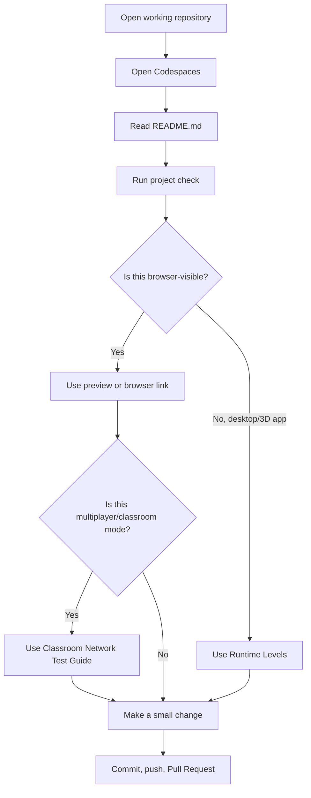

# SPRK CodeSpaces User Guide
This guide explains when to use GitHub Codespaces, what to do after opening it, and where troubleshooting fits.

## Table Of Contents
- [What Codespaces Is](#what-codespaces-is)
- [Codespaces Flow](#codespaces-flow)
- [Open Codespaces](#open-codespaces)
- [Run The Project Check](#run-the-project-check)
- [Runtime Levels](#runtime-levels)
- [Multiplayer Project Prerequisite](#multiplayer-project-prerequisite)
- [Troubleshooting](#troubleshooting)

## What Codespaces Is
Codespaces is a cloud computer in your browser. It lets you read code, edit files, run checks, commit, push, and open Pull Requests without setting up a personal laptop.

Best first use:

```text
Open repo
  |
  v
Open Codespaces
  |
  v
Read README
  |
  v
Run safe project check
  |
  v
Make one small change
  |
  v
Commit, push, Pull Request
```

## Codespaces Flow
Use this flow to decide which section matters.



Plain version:

```text
Codespaces first
  -> safe check
  -> browser preview if available
  -> classroom network test only for multiplayer projects
  -> troubleshooting only when something breaks
```

## Open Codespaces
From a GitHub repository:

1. Click `Code`.
2. Open the `Codespaces` tab.
3. Create or open a Codespace.
4. Read `README.md`.
5. Run the project check from that repository.

## Run The Project Check
For `SPRK-Hello-Repo`, use the check command documented inside that repository.

For Python repositories that provide a safe check, the command usually looks like:

```bash
python -m core.main --check
```

The check should validate the project without opening a desktop graphics window.

## Runtime Levels
Runtime levels matter when a project needs more than normal browser preview.

```text
Level A - Code/check only
Use Codespaces to read, edit, and run the safe check.

Level B - Browser-visible app
Use Codespaces preview or a browser link.

Level C - Local/classroom backend
One laptop runs the backend; other devices join from a browser.

Level D - Desktop/3D visual test
Use a graphics-capable laptop or advanced virtual desktop setup.
```

Most first projects should use Level A or Level B. Multiplayer classroom projects use Level C. Advanced 3D projects may need Level D.

## Multiplayer Project Prerequisite
This is not required for every project.

Use the classroom device/network test only when the project needs multiple students to connect to one backend.

Examples:

- `nP` classroom games.
- shared scoreboards.
- quiz rooms.
- frontend/backend projects where phones or Chromebooks join the same game.

Guide:

```text
docs/SPRK_Classroom_Network_Test_Guide.md
```

## Troubleshooting
### Troubleshooting Table Of Contents
- [Copilot Chat Took Too Long](#copilot-chat-took-too-long)
- [Desktop Or 3D App Will Not Open](#desktop-or-3d-app-will-not-open)

### Copilot Chat Took Too Long
Symptom:

```text
Chat took too long to get ready. Please ensure you are signed in to GitHub and that the extension GitHub.copilot-chat is installed and enabled.
```

Fix:

1. Confirm Codespaces is signed in as the expected GitHub account.
2. Open Extensions with `Ctrl+Shift+X`.
3. Search for `GitHub Copilot Chat`.
4. Install or enable `GitHub Copilot Chat`.
5. Reload the window with `Ctrl+Shift+P`, then `Developer: Reload Window`.
6. Click `Restart` in the Chat panel if the warning remains.

Terminal check:

```bash
code --list-extensions --show-versions | grep -i copilot
```

Expected useful result:

```text
GitHub.copilot-chat@...
```

### Desktop Or 3D App Will Not Open
If Codespaces shows this:

```text
Exception: No graphics pipe is available!
```

that means the app cannot find a graphical display.

Use the safe check in Codespaces. Run visible desktop or 3D apps on a graphics-capable laptop.
