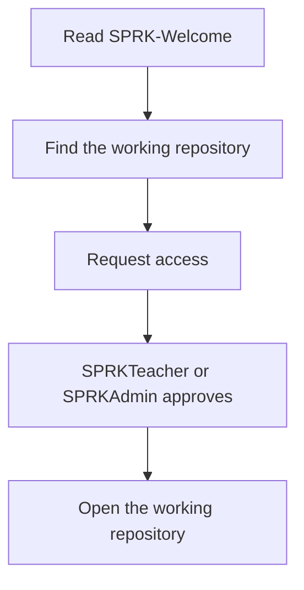

# SPRK Welcome User Guide

This guide is for SPRK students and members who are starting from GitHub.

## Master Table Of Contents

- [Create Or Convert A SPRK GitHub Account](#create-or-convert-a-sprk-github-account)
- [Request Access](#request-access)
- [Open A Working Repository](#open-a-working-repository)
- [Use Codespaces](#use-codespaces)
- [Create Your Branch](#create-your-branch)
- [Open A Pull Request](#open-a-pull-request)
- [View Diagrams](#view-diagrams)

## Create Or Convert A SPRK GitHub Account

SPRK member accounts use a consistent clan-style identity.

Recommended pattern:

- Public profile name: `FirstName SPRK`
- GitHub username: `FirstName-SPRK`
- Email pattern: `firstname.SPRK@gmail.com`
- Branch name: `firstname-sprk`

Example:

- Public profile name: `Maya SPRK`
- GitHub username: `Maya-SPRK`
- Email: `maya.SPRK@gmail.com` when available
- Branch name: `maya-sprk`

If you already have a GitHub account and want to convert it:

1. Sign in to that GitHub account.
2. Open GitHub `Settings`.
3. In `Public profile`, set first name to your first name and last name to `SPRK`.
4. In `Account`, change the username to `FirstName-SPRK` if available.
5. Sign out and sign back in if Codespaces or GitHub still shows the old name.

Caution:

Changing a GitHub username can affect old profile links, repository links, bookmarks, mentions, Codespaces display, local Git remotes, and connected tools. If the account already has important prior work, create a new SPRK account instead of converting the old one.

## Request Access

SPRK-Welcome is public. Some working repositories may be private.

Student flow:

```text
Read SPRK-Welcome
  |
  v
Find the working repository
  |
  v
Request access
  |
  v
SPRKTeacher or SPRKAdmin approves
  |
  v
Open the working repository
```

Mermaid version:



## Open A Working Repository

Use the full GitHub project link:

```text
https://github.com/<owner>/<repository>
```

Example:

```text
https://github.com/Mr-PI-Bala/SPRK-Hello-Ursina
```

Use the `.git` URL when cloning or adding a Git remote:

```text
https://github.com/<owner>/<repository>.git
```

## Use Codespaces

Codespaces lets a student work in a browser without setting up a laptop development environment.

After opening a working repository:

1. Click `Code`.
2. Choose `Codespaces`.
3. Create or open a Codespace.
4. Read the repository's `README.md` and `docs/USER_GUIDE.md`.
5. Run the safe project check described by that repository.

## Create Your Branch

Use your GitHub username as your branch name, in lowercase.

Example:

```bash
git checkout -b maya-sprk
```

Students commit work to their branch and open a Pull Request for review.

## Open A Pull Request

After pushing your branch, open a Pull Request.

`SPRKTeacher` or `SPRKAdmin` reviews the work before it enters `main`.

## View Diagrams

SPRK uses Mermaid diagrams in Markdown.

Students do not need a Mermaid account. GitHub renders Mermaid diagrams directly in Markdown. Codespaces can preview them with Markdown Preview and the recommended `Markdown Mermaid` extension.
