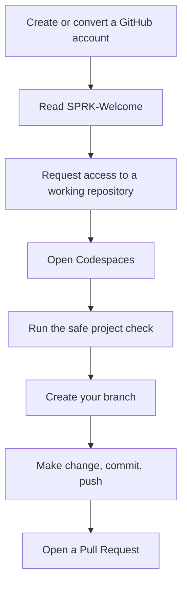

# SPRK Welcome User Guide

This guide is the front door for SPRK students and members starting from GitHub.

For detailed toolchain instructions, use the master SPRK guides:

- [SPRK Git Repository User Guide](SPRK_Git_Repository_UserGuide.md)
- [SPRK CodeSpaces User Guide](SPRK_CodeSpaces_UserGuide.md)
- [SPRK VS Code User Guide](SPRK_VSCode_UserGuide.md)

## Table Of Contents

- [Start Here](#start-here)
- [SPRK Path](#sprk-path)
- [Working Repositories](#working-repositories)
- [What To Read Next](#what-to-read-next)

## Start Here

SPRK-Welcome is public. It explains how students find working repositories, request access, open Codespaces, and work on their own branches.

Official doorway:

```text
https://github.com/Mr-PI-Bala/SPRK-Welcome
```

Primary hello-project repository:

```text
https://github.com/Mr-PI-Bala/SPRK-Hello-Repo
```

## SPRK Path

```text
Create or convert a GitHub account
  |
  v
Read SPRK-Welcome
  |
  v
Request access to SPRK-Hello-Repo when needed
  |
  v
Open Codespaces or a browser-visible project
  |
  v
Run the safe project check
  |
  v
Create your branch
  |
  v
Make change, commit, push, and open a Pull Request
```

Mermaid version:



## Working Repositories

Working repositories are where students build and test projects.

Primary example:

```text
https://github.com/Mr-PI-Bala/SPRK-Hello-Repo
```

If a working repository is private, request access using the [SPRK Git Repository User Guide](SPRK_Git_Repository_UserGuide.md).

## What To Read Next

- Need GitHub access, branches, commits, pushes, or pull requests: [SPRK Git Repository User Guide](SPRK_Git_Repository_UserGuide.md)
- Need Codespaces setup, safe checks, or graphics limits: [SPRK CodeSpaces User Guide](SPRK_CodeSpaces_UserGuide.md)
- Need Markdown preview, editing, Mermaid, or extension guidance: [SPRK VS Code User Guide](SPRK_VSCode_UserGuide.md)
